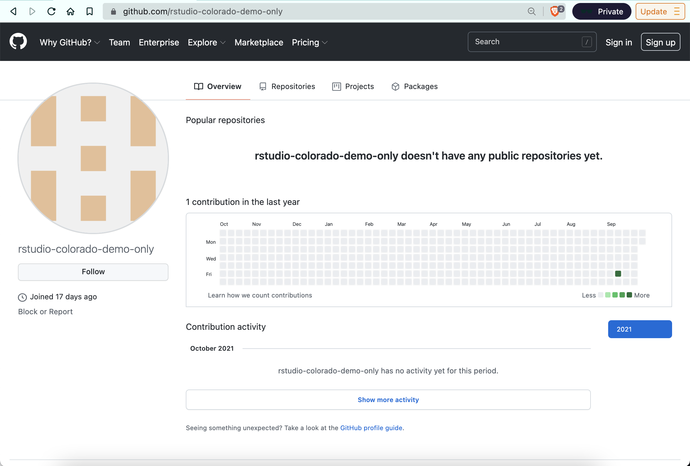
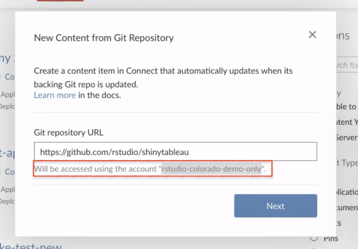

```{r setup, include=FALSE}
options(htmltools.dir.version = FALSE)
```

class: center, middle
## Q: Can I use git-backed publishing if my repo is private?
## A: Yes, just use a service account. Reference this section of the Admin Guide: .smaller[https://docs.rstudio.com/connect/admin/content-management/git-backed/#private-repos]
### *subtext: this is an exercise left to the reader*
---
class: center, inverse, middle
# Here's what it looks like using GitHub<sup>1</sup>
.footnote[
[1] This may look different for GitLab, Azure DevOps, or other git hosts
]
---
## 1.\ Create a service account on your git host  
Meet "rstudio-colorado-demo-only" `r emo::ji("wave")` <br>
<center></center>

An admin or someone responsible should own the service account because they will need to accept share requests coming from private repos (this happens in step 5)
---
## 2.\ Create a GitHub PAT (Personal Access Token) for this service account 
Scope the permissions to allow it to see repos  
---
## 3.\ Update the Connect `.gcfg` file to provide the credentials for the service account  
Example:  

```
[GitCredential "GitHub"]
Host = "github.com"
Username = "my_username"
Password = my-encrypted-password
Protocol = "https"
```

The password is the PAT.
---
## 4.\ Invite the service account to be a collaborator on your private repo (read access minimum)
<center></center>
<br>
---
## 5.\ Service account owner has to accept invitation! `r fontawesome::fa(name = "hourglass-half", fill = "#900C3F")`  
<center></center>  

If the admin has not accepted the share request, import from git won't be able to find the repo. This could be different for other git hosts (GitLab, Azure DevOps, etc.), but GitHub users can't automatically accept collaboration request
---
## 6.\ Select git-backed publishing from RStudio Connect  
.smaller[Note that once a service account is defined in the `.gcfg` file, this will be the account used to access all content. See highlighted text:
<center></center> ] 
---

## Additional Points
* If you had multiple git hosts, you would enter them sequentially:
.smaller[
  ```{}
  [GitCredential "GitHub"]
  Host = "github.com"
  Username = "my_username"
  Password = my-encrypted-password
  Protocol = "https"
  
  [GitCredential "BitBucket"]
  Host = "bitbucket.org"
  Username = "my_bitbucket_username"
  Password = my-encrypted-password
  Protocol = "https"
  ```
  ]
* The name after `GitCredential` is just a user-defined shortname.

* You can only have .orange[**_one service account for each host_**.]
---
## Considerations on One Service Account per Host

* There's a trade off in considering one service account defined at the product configuration level versus having user-level service accounts  

* .orange[**Customer feedback around this is very valuable**] 

* Considerations around user-level service accounts include concern over losing access to content if a user leaves the company

* A workable remedy for teams with existing organizational delineation is to set up multiple Connect servers, each with different service accounts configured in their respective `.gcfg` file (e.g., HR has their server and their service account; Finance has their server with their own service account) 


